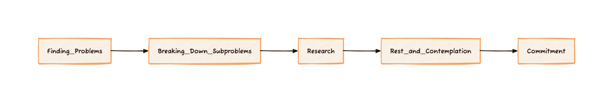
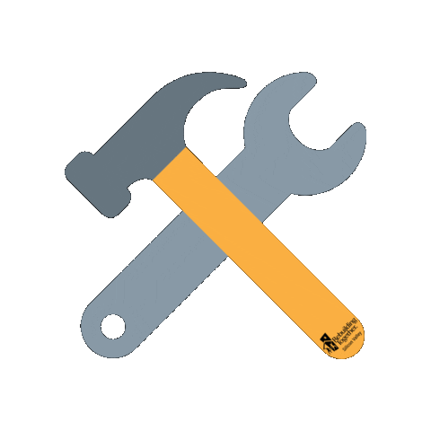

# Hi   

   

<!-- BLOG-POST-LIST:START -->

	
 Tools  

     
                             < </a>   

	
 Blog Posts   

    <ul>
      <li>
        <a href="https://ajitirtoprayogo.medium.com/catatan-pull-request-0b66fbc2bf46">Pull Request: Kunci Kolaborasi Efektif di GitHub</a>
      </li>
      <li>
        <a href="https://medium.com/@ajitirtoprayogo/bye-bye-ftp-halo-git-pull-cara-cepat-deploy-proyekmu-a63f0e0fe982">Bye-bye FTP, Halo Git Pull: Cara Lebih Cepat Untuk Deploy</a>
      </li>
    </ul>

	
   Status

	
    

  
 Profiles

    
  

  
 Connect With Me

  

    
     
    
    

## 

  
 <a href="https://drive.google.com/file/d/1XeJUIumt7eM_T3MFU31WtxV8uReVIJgx/view?usp=sharing" target="blank"> 📄 Resume</a>

